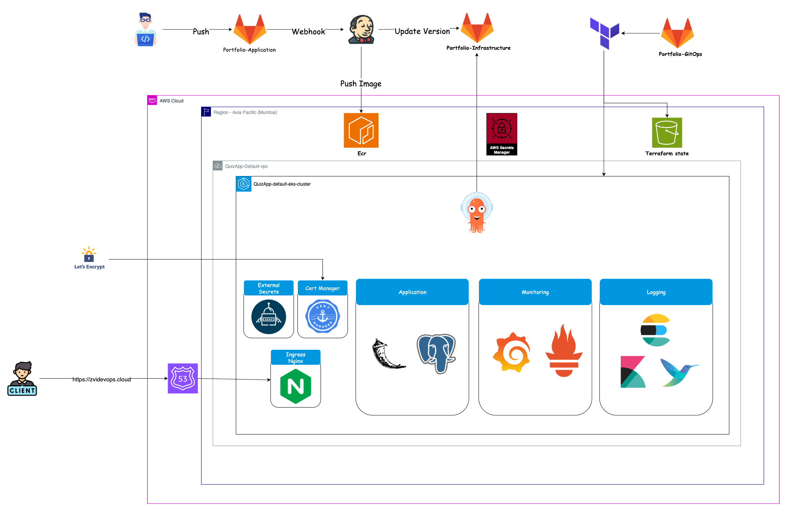
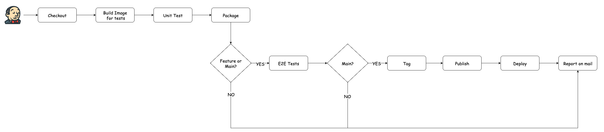
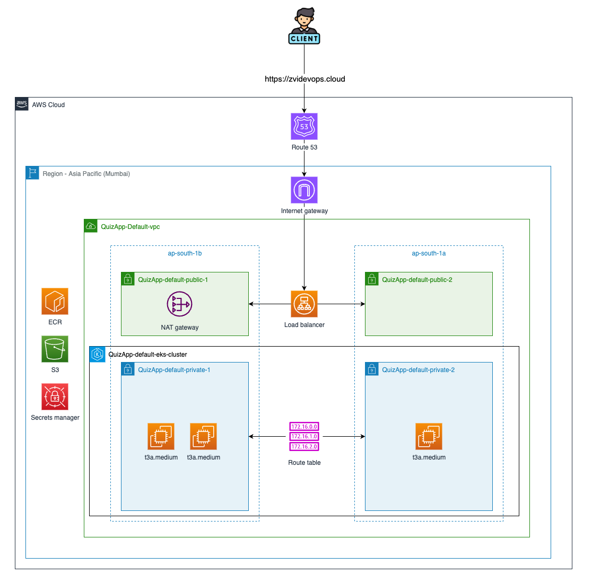
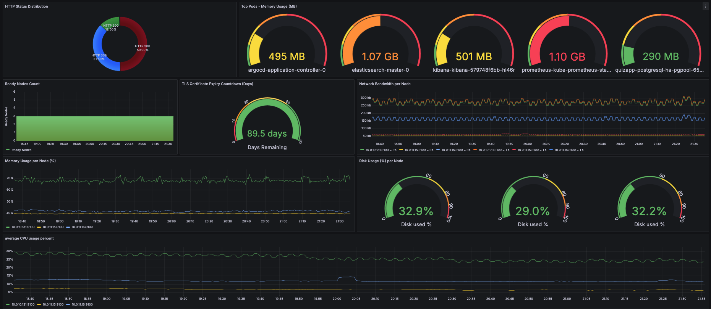

# DevOps Portfolio 

This portfolio project demonstrates various aspects of DevOps practices through a comprehensive setup involving application development, CI/CD pipelines, cloud-based infrastructure, microservices, GitOps, logging, and monitoring.

## 🚀 Project Overview

This portfolio demonstrates a full-stack DevOps implementation featuring:

- **Flask Quiz Application** - Interactive web application with user management and quiz functionality
- **AWS EKS Infrastructure** - Production-ready Kubernetes cluster with Terraform IaC
- **GitOps Deployment** - Automated deployment and management with ArgoCD
- **Complete CI/CD Pipeline** - Jenkins-based automation with comprehensive testing
- **Monitoring & Logging** - Prometheus, Grafana, ELK stack integration
- **Security & Compliance** - TLS certificates, secrets management, RBAC

## 📁 Repository Structure

```
Portfolio/
├── Application/           # Flask Quiz Application
│   ├── app/              # Core application code
│   ├── templates/        # HTML templates
│   ├── static/           # CSS, JS, images
│   ├── tests/            # Unit and E2E tests
│   ├── docker-compose.yml
│   ├── Dockerfile
│   └── Jenkinsfile       # CI/CD pipeline
│
├── Infrastructure/        # AWS EKS Terraform Infrastructure
│   ├── modules/          # Reusable Terraform modules
│   │   ├── network/      # VPC, subnets, routing
│   │   ├── security/     # IAM roles, security groups
│   │   ├── eks/          # EKS cluster configuration
│   │   ├── ebs-csi/      # Storage configuration
│   │   └── argocd/       # GitOps setup
│   ├── main.tf
│   ├── variables.tf
│   └── providers.tf
│
├── GitOps/               # Kubernetes Manifests & ArgoCD Apps
│   ├── application/      # Quiz app Helm chart
│   ├── infra-apps/       # Infrastructure components
│   │   ├── monitoring/   # Prometheus, Grafana
│   │   └── logging/      # ELK stack
│   ├── application-parent.yaml
│   └── infra-app-parent.yaml
│
└── Pics/                 # Project screenshots and diagrams
    ├── overview.png
    ├── ci_cd-flow.png
    ├── Infrastructure.png
    └── monitoring-dashboard.png
```

## 🛠 Technology Stack

### Application Layer

- **Backend**: Flask (Python), PostgreSQL HA
- **Frontend**: HTML5, CSS3, JavaScript
- **Authentication**: JWT tokens
- **Testing**: Pytest, E2E testing

### Infrastructure Layer

- **Cloud Provider**: AWS
- **Container Orchestration**: Amazon EKS (Kubernetes 1.32)
- **Infrastructure as Code**: Terraform
- **Networking**: VPC, Multi-AZ subnets, NAT Gateway
- **Storage**: EBS CSI driver with GP3 volumes

### DevOps & GitOps

- **CI/CD**: Jenkins Pipeline
- **GitOps**: ArgoCD
- **Container Registry**: Amazon ECR
- **Secrets Management**: AWS Secrets Manager
- **TLS/SSL**: cert-manager with Let's Encrypt

### Monitoring & Observability

- **Metrics**: Prometheus, Grafana
- **Logging**: Elasticsearch, Fluent Bit, Kibana
- **Ingress**: NGINX Ingress Controller
- **External Secrets**: External Secrets Operator

## 🏗 Architecture Overview



### High-Level Architecture

1. **Application Development** → Flask quiz app with comprehensive testing
2. **CI/CD Pipeline** → Jenkins automation with Docker containerization
3. **Infrastructure Provisioning** → Terraform deploys complete AWS EKS infrastructure
4. **Automated GitOps Setup** → Terraform installs ArgoCD and deploys all applications
5. **Monitoring & Logging** → Complete observability stack deployed automatically

### CI/CD Flow



## 🚀 Quick Start

### Prerequisites

- AWS CLI configured with appropriate permissions
- Terraform >= 1.0
- kubectl
- Docker
- Git

### 1. Deploy Complete Infrastructure

```bash
cd Infrastructure/
terraform init
terraform plan -var-file="terraform.tfvars"
terraform apply -var-file="terraform.tfvars"
```

**What Terraform Deploys:**

- ✅ AWS EKS cluster with managed node groups
- ✅ VPC, subnets, and networking components
- ✅ IAM roles and security groups
- ✅ ArgoCD installation and configuration
- ✅ Automatic kubectl configuration
- ✅ GitOps applications deployment (infra-apps and quiz app)

### 2. Verify Deployment

```bash
# Check cluster status
kubectl get nodes

# Check ArgoCD applications
kubectl get applications -n argocd

# Check quiz app deployment
kubectl get pods -n quizapp
```

### 3. Access the Application

- **Quiz App**: https://www.zvidevops.cloud
- **Grafana**: `kubectl port-forward svc/kube-prometheus-stack-grafana 3000:80 -n monitoring`
- **Kibana**: `kubectl port-forward svc/kibana-kibana 5601:5601 -n logging`

## 📊 Key Features

### Application Features

- ✅ User registration and authentication
- ✅ Interactive quiz creation and management
- ✅ Real-time scoring and statistics
- ✅ Responsive web interface
- ✅ RESTful API with comprehensive endpoints

### Infrastructure Features

- ✅ Production-ready EKS cluster with automatic setup
- ✅ Multi-AZ deployment for high availability
- ✅ Auto-scaling node groups
- ✅ Secure networking with private subnets
- ✅ IAM roles and security groups
- ✅ ArgoCD installation and GitOps configuration
- ✅ Automatic application deployment via Terraform

### DevOps Features

- ✅ Automated CI/CD with Jenkins
- ✅ GitOps deployment with ArgoCD
- ✅ Container security scanning
- ✅ Comprehensive test automation
- ✅ Infrastructure as Code with Terraform

### Monitoring & Security

- ✅ Prometheus metrics collection
- ✅ Grafana dashboards
- ✅ Centralized logging with ELK
- ✅ TLS certificates with Let's Encrypt
- ✅ AWS Secrets Manager integration

## 📸 Screenshots

### Application Dashboard


### Infrastructure Overview



### Monitoring Dashboard



### CI/CD Pipeline Success


## 🔧 Configuration

### Environment Variables

Key configuration files:

- `Infrastructure/terraform.tfvars` - Infrastructure settings
- `GitOps/application/values.yaml` - Application configuration
- `Application/.env` - Application environment variables

### Customization

Each component can be customized:

- **Application**: Modify Flask app settings and features
- **Infrastructure**: Adjust Terraform variables for different environments
- **GitOps**: Update Helm values and ArgoCD applications
- **Monitoring**: Configure Prometheus rules and Grafana dashboards

## 📈 Monitoring & Observability

- **Application Metrics**: Custom Prometheus metrics for quiz performance
- **Infrastructure Metrics**: EKS cluster, node, and pod metrics
- **Logging**: Centralized application and infrastructure logs
- **Alerting**: Grafana alerts for critical issues
- **Health Checks**: Kubernetes liveness and readiness probes

## 🔒 Security

- **Network Security**: Private subnets, security groups, NACLs
- **Identity & Access**: IAM roles, RBAC, service accounts
- **Data Protection**: Encrypted storage, TLS in transit
- **Secrets Management**: AWS Secrets Manager integration
- **Container Security**: Image scanning, non-root containers

## 🌟 Best Practices Implemented

- **Infrastructure as Code**: All infrastructure defined in Terraform
- **GitOps**: Declarative configuration management
- **Immutable Infrastructure**: Container-based deployments
- **Monitoring First**: Comprehensive observability from day one
- **Security by Design**: Security controls at every layer
- **Automated Testing**: Unit, integration, and E2E tests
- **Documentation**: Comprehensive documentation and README files

## 🚀 Future Enhancements

- [ ] Multi-region deployment
- [ ] Advanced monitoring with custom SLIs/SLOs
- [ ] Chaos engineering with Chaos Monkey
- [ ] Advanced security scanning with Falco
- [ ] Cost optimization with Spot instances
- [ ] Blue/Green deployment strategies

## 👨‍💻 Author

**Zvi Abramovich** - DevOps Engineer

- 📧 Email: zviabramovich22@gmail.com
- 🌐 Domain: zvidevops.cloud

---

This portfolio demonstrates practical DevOps skills including cloud infrastructure, containerization, CI/CD automation, GitOps, monitoring, and security best practices. Each component is production-ready and follows industry standards.

Feel free to explore the code, ask questions, or suggest improvements!
